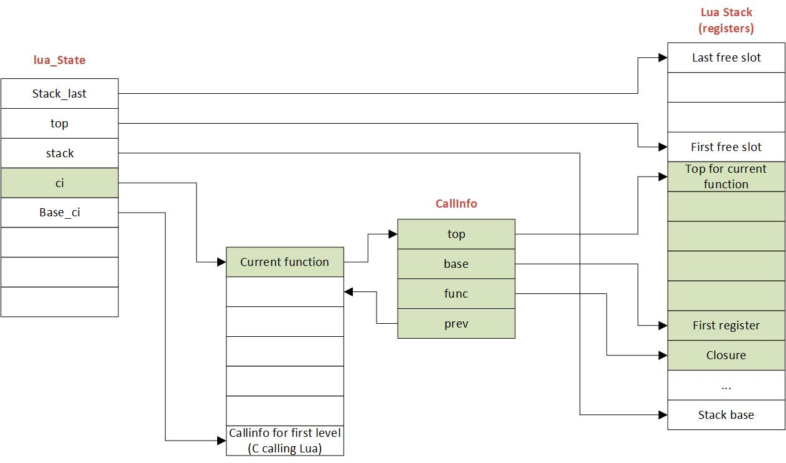

=========================================
Lua Parsing and Code Generation Internals
=========================================

Stack and Registers
===================
Lua employs two stacks.
The ``Callinfo`` stack tracks activation frames. 
There is the secondary stack ``L->stack`` that is an array of ``TValue`` objects. The ``Callinfo`` objects index into this array. Registers are basically slots in the ``L->stack`` array.

When a function is called - the stack is setup as follows::

  stack
  |            function reference
  |  base->    parameter 1
  |            ... 
  |            parameter n
  |            local 1
  |            ...
  |            local n
  |  top->     
  |  
  V

So top is just past the registers needed by the function. 
The number of registers is determined based on locals and temporaries.

The base of the stack is set to just past the function reference - i.e. on the first parameter or register.
All register addressing is done as offset from base - so ``R(0)`` is at ``base+0`` on the stack. 

   The figure shows how the stack is related to other Lua  objects.

A description of the stack and registers from Mike Pall on Lua mailing list is reproduced below.

Sliding Register Window - by Mike Pall
-------------------------------------- 
Note: this is a reformatted version of a post on Lua mailing list (see MP6 link below).

The Lua 5 VM employs a sliding register window on top of a stack. Frames
(named CallInfo aka 'ci' in the source) occupy different (overlapping)
ranges on the stack. Successive frames are positioned exactly over the
passed arguments (luaD_precall). The compiler ensures that there are no
live variables after the arguments for a call. Return values need to be
copied down (with truncate/extend) to the slot holding the function object
(luaD_poscall). This is because the compiler has no idea how many values
another function may return -- only how many need to be stored.

Example::

  function f2(arg1, arg2, ..., argN)
    local local1, local2, ...
    ...
    return ret1, ret2, ..., retO
  end

  function f1(arg1, arg2, ..., argM)
    local local1, local2, ...
    ...
    local ret1, ret2, ..., retP = f2(arg1, arg2, ..., argN)
    ...
  end

Simplified stack diagram::

  stack
  |
  | time: >>>> call >>>>>>>>>>>>>>>>>> call ~~~~~~~~~~~~~~~~~~ return >>>>>
  |
  |   ciX.func-> f1      f1      f1                                 f1
  |   ciX.base-> arg1    arg1    arg1                               arg1
  |              arg2    arg2    arg2                               arg2
  |              ...     ...     ...                                ...
  |              argM    argM    argM                               argM
  |   ciX.topC->         local1  local1                             local11
  |                      local2  local2                             local2
  |                      local3  local3                             local3
  |                      ...     ...                                ...
  |                              f2      ciY.func-> f2      f2      ret1
  |                              arg1    ciY.base-> arg1    arg1    ret2
  |                              arg2               arg2    arg2    ...
  |                              ...                ...     ...     retP
  |                              argN               argN    argN
  |   ciX.topL-> ------  ------  ------  ciY.topC-> local1  local1
  |                                                 local2  local2
  |                                                 ...     ...
  |                                                         ret1
  |                                                         ret2
  |                                                         ...
  |                                                         retO
  |                                      ciY.topL-> ------  ------
  V

Note that there is only a single 'top' for each frame:

For Lua functions the top (tagged topL in the diagram) is set to the base
plus the maximum number of slots used. The compiler knows this and stores
it in the function prototype. The top pointer is used only temporarily
for handling variable length argument and return value lists.

For C functions the top (tagged topC in the diagram) is initially set to
the base plus the number of passed arguments. C functions can access their
part of the stack via Lua API calls which in turn change the stack top.
C functions return an integer that indicates the number of return values
relative to the stack top.

In reality things are a bit more complex due to overlapped locals, block
scopes, varargs, coroutines and a few other things. But this should get
you the basic idea.

Parsing and Code Generation
===========================
* The parser is in `lparser.c <http://www.lua.org/source/5.3/lparser.c.html>`_.
* The code generator is in both above and `lcode.c <http://www.lua.org/source/5.3/lcode.c.html>`_.

The parser and code generator are arguably the most complex piece in the whole of Lua. The parser is one-pass - and generates code as it parses. That is, there is no AST build phase. This is primarily for efficiency it seems. The parser uses data structures on the stack - there are no heap allocated structures. Where needed the C stack itself is used to build structures - for example, as the assignment statement is parsed, there is recursion, and a stack based structure is built that links to structures in the call stack. 

The main object used by the parser is the ``struct expdesc``::

  typedef struct expdesc {
    expkind k;
    union {
      struct {  /* for indexed variables (VINDEXED) */
        short idx;  /* index (R/K) */
        lu_byte t;  /* table (register or upvalue) */
        lu_byte vt;  /* whether 't' is register (VLOCAL) or upvalue (VUPVAL) */
      } ind;
      int info;  /* for generic use */
      lua_Number nval;  /* for VKFLT */
      lua_Integer ival;    /* for VKINT */
    } u;
    int t;  /* patch list of 'exit when true' */
    int f;  /* patch list of 'exit when false' */
    int ravi_type; /* RAVI change: type of the expression if known, else LUA_TNONE */
  } expdesc;

The code is somewhat hard to follow as the ``expdesc`` objects go through various states and are also reused when needed. 

As the parser generates code while parsing it needs to go back and patch the generated instructions when it has more information. For example when a function call is parsed the parser assumes that only 1 value is expected to be returned - but later this is patched when more information is available. The most common example is when the register where the value will be stored (operand A) is not known - in this case the parser later on updates this operand in the instruction. I believe jump statements have similar mechanics - however I have not yet gone through the details of these instructions.

Handling of Stack during parsing
--------------------------------
Functions have a register window on the stack.
The stack is represented in ``LexState->dyd.actvar`` (Dyndata) 
structure (see llex.h). The register window of the function 
starts from ``LexState->dyd.actvar.arr[firstlocal]``. 

The 'active' local variables 
of the function extend up to ``LexState->dyd.actvar.arr[nactvar-1]``. Note that 
when parsing a ``local`` declaration statement the ``nactvar`` is adjusted at the end of 
the statement so that during parsing of the statement the ``nactvar``
covers locals up to the start of the statement. This means that 
local variables come into scope (become 'active') after the local statement ends.
However, if the local statement defines a function then the variable becomes 'active'
before the function body is parsed.

A tricky thing to note is that while ``nactvar`` is adjusted at the end of the 
statement - the 'stack' as represented by ``LexState->dyd.actvar.arr`` is extended to the required 
size as the local variables are created by ``new_localvar()``. 

When a function is the topmost function being parsed, the 
registers between ``LexState->dyd.actvar.arr[nactvar]`` and ``LexState->dyd.actvar.arr[freereg-1]`` 
are used by the parser for evaluating expressions - i.e. these are part of the 
local registers available to the function 

Note that function parameters are handled as locals.
  
Example of what all this mean.  Let's say we are parsing following chunk of code::

   function testfunc()
     -- at this stage 'nactvar' is 0 (no active variables)
     -- 'firstlocal' is set to current top of the variables stack 
     -- LexState->dyd.actvar.n (i.e. excluding registers used for expression evaluation)
     -- LexState->dyd.actvar.n = 0 at this stage
     local function tryme()
       -- Since we are inside the local statement and 'tryme' is a local variable,
       -- the LexState->dyd.actvar.n goes to 1. As this is a function definition
       -- the local variable declaration is deemed to end here, so 'nactvar' for testfunc()
       -- is gets set to 1 (making 'tryme' an active variable). 
       -- A new FuncState is created for 'tryme' function.
       -- The new tryme() FunState has 'firstlocal' set to value of LexState->dyd.actvar.n, i.e., 1
       local i,j = 5,6
       -- After 'i' is parsed, LexState->dyd.actvar.n = 2, but 'nactvar' = 0 for tryme() 
       -- After 'j' is parsed, LexState->dyd.actvar.n = 3, but 'nactvar' = 0 for tryme()
       -- Only after the full statement above is parsed, 'nactvar' for tryme() is set to '2'
       -- This is done by adjustlocalvar().
       return i,j
     end
     -- Here two things happen
     -- Firstly the FuncState for tryme() is popped so that 
     -- FuncState for testfunc() is now at top
     -- As part of this popping, leaveblock() calls removevars() 
     -- to adjust the LexState->dyd.actvar.n down to 1 where it was 
     -- at before parsing the tryme() function body.
     local i, j = tryme() 
     -- After 'i' is parsed, LexState->dyd.actvar.n = 2, but 'nactvar' = 1 still
     -- After 'j' is parsed, LexState->dyd.actvar.n = 3, but 'nactvar' = 1 still
     -- At the end of the statement 'nactvar' is set to 3.
     return i+j
   end
   -- As before the leaveblock() calls removevars() which resets
   -- LexState->dyd.actvar.n to 0 (the value before testfunc() was parsed)

A rough debug trace of the above gives::

   function testfunc()
     -- open_func -> fs->firstlocal set to 0 (ls->dyd->actvar.n), and fs->nactvar reset to 0
     local function tryme()
       -- new_localvar -> registering var tryme fs->f->locvars[0] at ls->dyd->actvar.arr[0]
       -- new_localvar -> ls->dyd->actvar.n set to 1
       -- adjustlocalvars -> set fs->nactvar to 1
       -- open_func -> fs->firstlocal set to 1 (ls->dyd->actvar.n), and fs->nactvar reset to 0
       -- adjustlocalvars -> set fs->nactvar to 0 (no parameters)
       local i,j = 5,6
       -- new_localvar -> registering var i fs->f->locvars[0] at ls->dyd->actvar.arr[1]
       -- new_localvar -> ls->dyd->actvar.n set to 2
       -- new_localvar -> registering var j fs->f->locvars[1] at ls->dyd->actvar.arr[2]
       -- new_localvar -> ls->dyd->actvar.n set to 3
       -- adjustlocalvars -> set fs->nactvar to 2
       return i,j
       -- removevars -> reset fs->nactvar to 0
     end
     local i, j = tryme()
     -- new_localvar -> registering var i fs->f->locvars[1] at ls->dyd->actvar.arr[1]
     -- new_localvar -> ls->dyd->actvar.n set to 2
     -- new_localvar -> registering var j fs->f->locvars[2] at ls->dyd->actvar.arr[2]
     -- new_localvar -> ls->dyd->actvar.n set to 3
     -- adjustlocalvars -> set fs->nactvar to 3
     return i+j
     -- removevars -> reset fs->nactvar to 0
   end

Notes on Parser by Sven Olsen 
-----------------------------

"discharging" expressions
~~~~~~~~~~~~~~~~~~~~~~~~~
  
"discharging" takes an expression of arbitrary type, and
converts it to one having particular properties.

the lowest-level discharge function is ``discharge2vars ()``,
which converts an expression into one of the two "result"
types; either a ``VNONRELOC`` or a ``VRELOCABLE``.
 
if the variable in question is a ``VLOCAL``, ``discharge2vars`` 
will simply change the stored type to ``VNONRELOC``.

much of lcode.c assumes that the it will be working with
discharged expressions.  in particular, it assumes that if
it encounters a ``VNONRELOC`` expression, and ``e->info < nactvar``,
then the register referenced is a local, and therefore
shouldn't be implicitly freed after use.

local variables
~~~~~~~~~~~~~~~

however, the relationship between ``nactvar`` and locals is
actually somewhat more complex -- as each local variable
appearing in the code has a collection of data attached to
it, data that's being accumulated and changed as the lexer
moves through the source.

``fs->nlocvars`` stores the total number of named locals inside 
the function -- recall that different local variables are
allowed to overlap the same register, depending on which
are in-scope at any particular time.

the list of locals that are active at any given time is
stored in ``ls->dyd`` -- a vector of stack references that grows
or shrinks as locals enter or leave scope.

managing the lifetime of local variables involves several
steps.  first, new locals are declared using ``new_localvar``. 
this sets their names and creates new  references in ``dyd``. 
soon thereafter, the parser is expected  to call
``adjustlocalvar(ls,nvars)``, with ``nvars`` set to the number of
new locals.  ``adjustlocalvar`` increments ``fs->nactvar`` by ``nvars``,
and marks the startpc's of all the locals.

note that neither ``new_localvar`` or ``adjustlocalvar`` ensures
that anything is actually inside the registers being labeled
as locals.  failing to initialize said registers is an easy
way to write memory access bugs (peter's original table
unpack patch includes one such).  

after ``adjustlocalvar`` is called, ``luaK_exp2nextreg()`` will no
longer place new data inside the local's registers -- as
they're no longer part of the temporary register stack.

when the time comes to deactivate locals, that's done via
``removevars(tolevel)``.  ``tolevel`` is assumed to contain ``nactvars``
as it existed prior to entering the previous block.  thus,
the number of locals to remove should simply be
``fs->nactvar-tolevel``.  ``removevars(tolevel)`` will decrement
``nactvars`` down to ``tolevel``. it also shrinks the ``dyd`` vector,
and marks the endpc's of all the removed locals.  

except in between ``new_localvar`` and ``adjustlocalvar`` calls, i
believe that::

  fs->ls->dyd->actvar.n - fs->firstlocal == fs->nactvar

temporary registers
~~~~~~~~~~~~~~~~~~~
``freereg`` is used to manage the temporary register stack --
registers between [``fs->nactvars,fs->freereg``) are assumed to
belong to expressions currently being stored by the parser.

``fs->freereg`` is incremented explicitly by calls to
``luaK_reserveregs``, or implicitly, inside ``luaK_exp2nextreg``.
it's decremented whenever a ``freereg(r)`` is called on a
register in the temporary stack (i.e., a register for which
``r >= fs->nactvar``).

the temporary register stack is cleared when ``leaveblock()`` is
called, by setting ``fs->freereg=fs->nactvar``.  it's  also
partially cleared in other places -- for example,  inside
the evaluation of table constructors.

note that ``freereg`` just pops the top of the stack if r does
not appear to be a local -- thus it doesn't necessarily,
free r. one of the important sanity checks that you'll get
by enabling ``lua_assert()`` checks that the register being
freed is also the top of the stack.

when writing parser patches, it's your job to ensure  that
the registers that you've reserved are freed in an
appropriate order.

when a ``VINDEXED`` expression is discharged,  ``freereg()`` will be
called on both the table and the index register.  otherwise,
``freereg`` is only called from ``freeexp()`` -- which gets
triggered anytime an expression has been "used up";
typically, anytime it's been transformed into another
expression.

State Transitions
-----------------
The state transitions for ``expdesc`` structure are as follows:

+------------------+----------------------------------------+------------------------------------+
| expkind          | Description                            | State Transitions                  |
+==================+========================================+====================================+
|``VVOID``         | This is used to indicate the lack of   | None                               |
|                  | value - e.g. function call with no     |                                    |
|                  | arguments, the rhs of local variable   |                                    |
|                  | declaration, and empty table           |                                    |
|                  | constructor                            |                                    |
+------------------+----------------------------------------+------------------------------------+
|``VRELOCABLE``    | This is used to indicate that the      | In terms of transitions the        |
|                  | result from expression needs to be set | following expression kinds convert |
|                  | to a register. The operation that      | to ``VRELOCABLE``: ``VVARARG``     |
|                  | created the expression is referenced   | ``VUPVAL`` (``OP_GETUPVAL``        |
|                  | by the ``u.info`` parameter which      | ``VINDEXED`` (``OP_GETTABUP`` or   |
|                  | contains an offset into the ``code``   | ``OP_GETTABLE`` And following      |
|                  | of the function that is being compiled | expression states can result from  |
|                  | So you can access this instruction by  | a ``VRELOCABLE`` expression:       |
|                  | calling                                | ``VNONRELOC`` which                |
|                  | ``getcode(FuncState *, expdesc *)``    | means that the result register in  |
|                  | The operations that result in a        | the instruction operand A has been |
|                  | ``VRELOCABLE`` object include          | set.                               |
|                  | ``OP_CLOSURE`` ``OP_NEWTABLE``         |                                    |
|                  | ``OP_GETUPVAL`` ``OP_GETTABUP``        |                                    |
|                  | ``OP_GETTABLE`` ``OP_NOT`` and code    |                                    |
|                  | for binary and unary expressions that  |                                    |
|                  | produce values (arithmetic operations, |                                    |
|                  | bitwise operations, concat, length).   |                                    |
|                  | The associated code instruction has    |                                    |
|                  | operand ``A`` unset (defaulted to 0) - |                                    |
|                  | this the ``VRELOCABLE`` expression     |                                    |
|                  | must be later transitioned to          |                                    |
|                  | ``VNONRELOC`` state when the register  |                                    |
|                  | is set.                                |                                    |
+------------------+----------------------------------------+------------------------------------+
|``VNONRELOC``     | This state indicates that the output   | As for transitions, the            |
|                  | or result register has been set. The   | ``VNONELOC`` state results from    | 
|                  | register is referenced in ``u.info``   | ``VRELOCABLE`` after a register    |
|                  | parameter. Once set the register       | is assigned to the operation       |
|                  | cannot be changed for this expression; | referenced by ``VRELOCABLE``.      |
|                  | subsequent operations involving this   | Also a ``VCALL`` expression        |
|                  | expression can refer to the register   | transitions to ``VNONRELOC``       |
|                  | to obtain the result value.            | expression - ``u.info`` is set to  |
|                  |                                        | the operand ``A`` in the           |
|                  |                                        | call instruction. ``VLOCAL``       |
|                  |                                        | ``VNIL`` ``VTRUE`` ``VFALSE``      |
|                  |                                        | ``VK`` ``VKINT`` ``VKFLT`` and     |
|                  |                                        | ``VJMP`` expressions transition to |
|                  |                                        | ``VNONRELOC``.                     |
+------------------+----------------------------------------+------------------------------------+
|``VLOCAL``        | This is used when referencing local    | The ``VLOCAL`` expression may      |
|                  | variables. ``u.info`` is set to the    | transition to ``VNONRELOC``        |
|                  | local variable's register.             | although this doesn't change the   |
|                  |                                        | ``u.info`` parameter.              |
+------------------+----------------------------------------+------------------------------------+
|``VCALL``         | This results from a function call. The | In terms of transitions, the       |
|                  | ``OP_CALL`` instruction is referenced  | ``VCALL`` expression transitions   |
|                  | by ``u.info`` parameter and may be     | to ``VNONRELOC`` When this happens |
|                  | retrieved by calling                   | the result register in             |
|                  | ``getcode(FuncState *, expdesc *)``.   | ``VNONRELOC`` (``u.info`` is set   |
|                  | The ``OP_CALL`` instruction gets       | to the operand ``A`` in the        |
|                  | changed to ``OP_TAILCALL`` if the      | ``OP_CALL`` instruction.           |
|                  | function call expression is the value  |                                    |
|                  | of a ``RETURN`` statement.             |                                    |
|                  | The instructions operand ``C``         |                                    |
|                  | gets updated when it is known the      |                                    |
|                  | number of expected results from the    |                                    |
|                  | function call.                         |                                    |
+------------------+----------------------------------------+------------------------------------+
|``VINDEXED``      | This expression represents a table     | The ``VINDEXED`` expression        |
|                  | access. The ``u.ind.t`` parameter is   | transitions to ``VRELOCABLE``      |
|                  | set to the register or upvalue? that   | When this happens the ``u.info``   |
|                  | holds the table, the ``u.ind.idx`` is  | is set to the offset of the code   |
|                  | set to the register or constant that   | that contains the opcode           |
|                  | is the key, and ``u.ind.vt`` is either | ``OP_GETTABUP`` if ``u.ind.vt``    |
|                  | ``VLOCAL`` or ``VUPVAL``               | was ``VUPVAL`` or ``OP_GETTABLE``  |
|                  |                                        | if ``u.ind.vt`` was ``VLOCAL``     |
+------------------+----------------------------------------+------------------------------------+

Examples of Parsing
-------------------
example 1 
~~~~~~~~~

We investigate the simple code chunk below::

  local i,j; j = i*j+i

The compiler allocates following local registers, constants and upvalues::

  constants (0) for 0000007428FED950:
  locals (2) for 0000007428FED950:
        0       i       2       5
        1       j       2       5
  upvalues (1) for 0000007428FED950:
        0       _ENV    1       0

Some of the parse steps are highlighted below.

Reference to variable ``i`` which is located in register ``0``. The ``p`` here is the pointer address of ``expdesc`` object so you can see how the same object evolves::

  {p=0000007428E1F170, k=VLOCAL, register=0}

Reference to variable ``j`` located in register ``1``::

  {p=0000007428E1F078, k=VLOCAL, register=1}

Now the MUL operator is applied so we get following. Note that the previously ``VLOCAL`` expression for ``i`` is now ``VNONRELOC``::

  {p=0000007428E1F170, k=VNONRELOC, register=0} MUL {p=0000007428E1F078, k=VLOCAL, register=1}

Next code gets generated for the ``MUL`` operator and we can see that first expression is replaced by a ``VRELOCABLE`` expression. Note also that the ``MUL`` operator is encoded in the ``VRELOCABLE`` expression as instruction ``1`` which is decoded below::

  {p=0000007428E1F170, k=VRELOCABLE, pc=1, instruction=(MUL A=0 B=0 C=1)}

Now a reference to ``i`` is again required::

  {p=0000007428E1F078, k=VLOCAL, register=0}

And the ``ADD`` operator must be applied to the result of the ``MUL`` operator and above. Notice that a temporary register ``2`` has been allocated to hold the result of the ``MUL`` operator, and also notice that as a result the ``VRELOCABLE`` has now changed to ``VNONRELOC``::

  {p=0000007428E1F170, k=VNONRELOC, register=2} ADD {p=0000007428E1F078, k=VLOCAL, register=0}

Next the result of the ``ADD`` expression gets encoded similarly to ``MUL`` earlier. As this is a ``VRELOCABLE`` expression it will be later on assigned a result register::

  {p=0000007428E1F170, k=VRELOCABLE, pc=2, instruction=(ADD A=0 B=2 C=0)}

Eventually above gets assigned a result register and becomes ``VNONRELOC`` (not shown here) - and so the final generated code looks like below::

  main <(string):0,0> (4 instructions at 0000007428FED950)
  0+ params, 3 slots, 1 upvalue, 2 locals, 0 constants, 0 functions
        1       [1]     LOADNIL         0 1
        2       [1]     MUL             2 0 1
        3       [1]     ADD             1 2 0
        4       [1]     RETURN          0 1

Links
=====
* `(MP1) Lua Code Reading Order <http://www.reddit.com/comments/63hth/ask_reddit_which_oss_codebases_out_there_are_so/c02pxbpC>`_
* `(RL1) Registers allocation and GC <http://lua-users.org/lists/lua-l/2013-02/msg00075.html>`_
* `(MP2) LuaJIT interpreter optmisations <http://www.reddit.com/r/programming/comments/badl2/luajit_2_beta_3_is_out_support_both_x32_x64/c0lrus0>`_
* `(MP3) Performance of Switch Based Dispatch <http://lua-users.org/lists/lua-l/2011-02/msg00742.html>`_
* `(MP4) Challenges for static compilation of dynamic langauges <http://lua-users.org/lists/lua-l/2009-06/msg00071.html>`_
* `(MP5) VM Internals (bytecode format) <http://lua-users.org/lists/lua-l/2008-07/msg00651.html>`_
* `(RL2) Upvalues in closures <http://lua-users.org/lists/lua-l/2008-09/msg00076.html>`_
* `(LHF) Lua bytecode dump format <http://lua-users.org/lists/lua-l/2006-06/msg00205.html>`_
* `(MP6) Register VM and sliding stack window <http://lua-users.org/lists/lua-l/2005-01/msg00628.html>`_
* `(SO1) Sven Olsen's notes on registers <http://lua-users.org/files/wiki_insecure/power_patches/5.2/svenshacks-5.2.2.patch>`_ from `Sven Olsen's Lua Users Wiki page <http://lua-users.org/wiki/SvenOlsen>`_
* `(KHM) No Frills Introduction to Lua 5.1 VM Instructions <http://luaforge.net/docman/83/98/ANoFrillsIntroToLua51VMInstructions.pdf>`_
* `(MP7) LuaJIT Roadmap 2008 <http://lua-users.org/lists/lua-l/2008-02/msg00051.html>`_
* `(MP8) LuaJIT Roadmap 2011 <http://lua-users.org/lists/lua-l/2011-01/msg01238.html>`_
