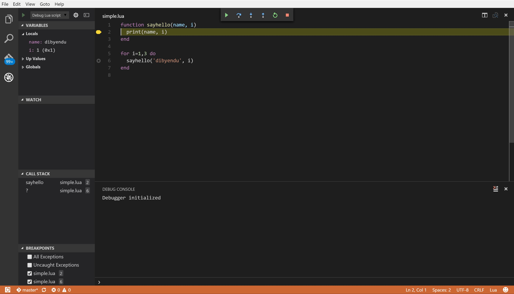

Ravi Debug Adapter for VSCode
=============================

The aim is to provide a debug adapter that allows Microsoft's Visual Studio Code to step through Ravi or 
Lua code. 

Implementation Notes
--------------------
The approach is to create a standalone executable that can be invoked by VSCode. VSCode communicates 
with the adapter via stdin/stdout. This means that Lua cannot use stdin/stdout - but for now nothing is done
to prevent Lua access to these. 

VSCode communicates with the adapter using a JSON wire protocol.

Status
------
This is work in progress but the basic debugger is working with following features.

* Launch a Ravi/Lua program and stop on entry
* Step through code (stepin, stepout, next all behave as stepin)
* Set breakpoints at line/source level
* Only local variables are shown in the Variables window
* No expansion of aggregate structures such as tables yet
* Only source files that are available on disk can be debugged 

Only tested on Windows 10 so far.
Please note that this is not yet ready for use so try at your own risk!

Installation
------------
To install first build Ravi. 
You should see an executable named `ravidebug` in the build directory.

Install the debugger extension as follows:

1. Create a directory named `.vscode/extensions/dibyendumajumdar.ravi-debug-0.0.1/bin` under the home directory. On Windows 10 this is under /Users/<username>.
2. Copy the `ravidebug` executable to the bin folder created above.
3. Copy the file `vscode-debugger/vscode/extensions/dibyendumajumdar.ravi-debug-0.0.1/package.json` to the directory `.vscode/extensions/dibyendumajumdar.ravi-debug-0.0.1`.

Now when you open a directory containing Lua programs VSCode should allow you to launch a debug session. You will need to change the launch parameters as required but note that right now `LUA_PATH` and `LUA_CPATH` are not passed on to the debugger.

Screenshots
-----------

